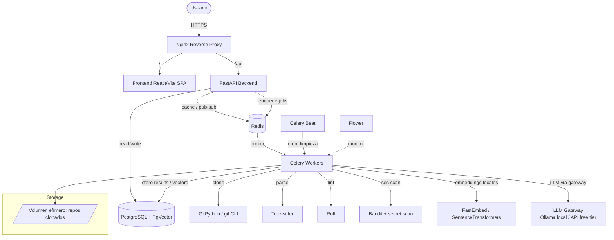
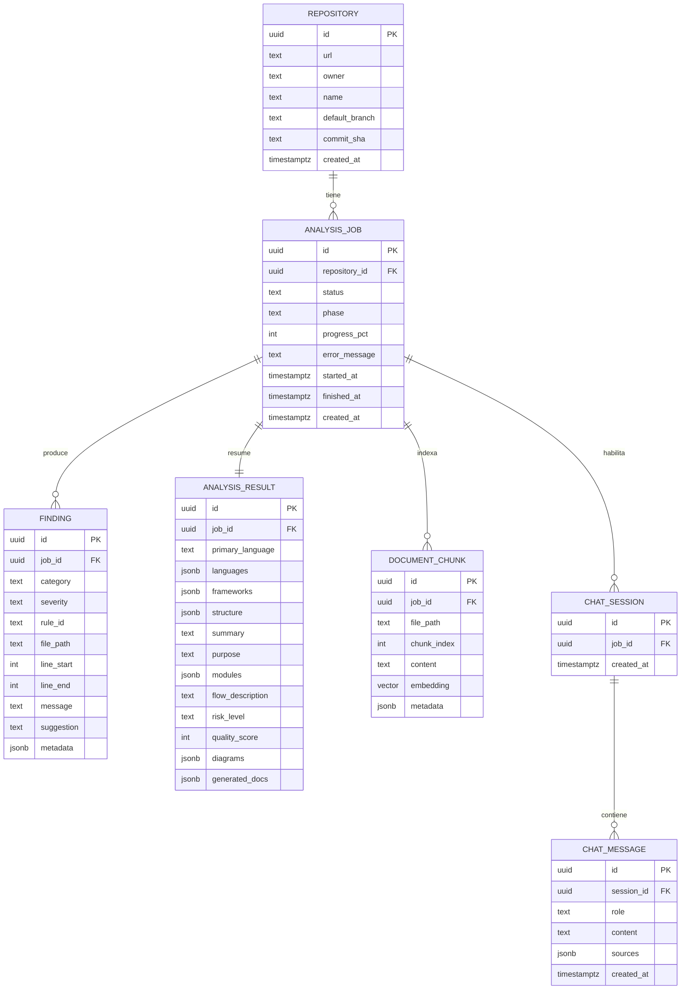
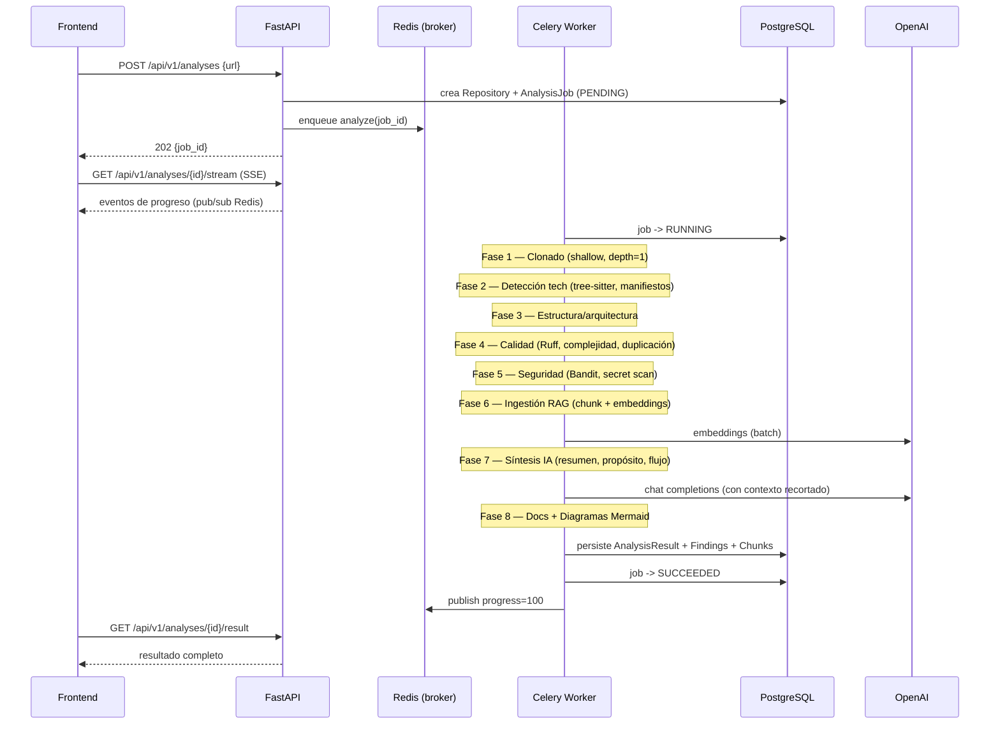
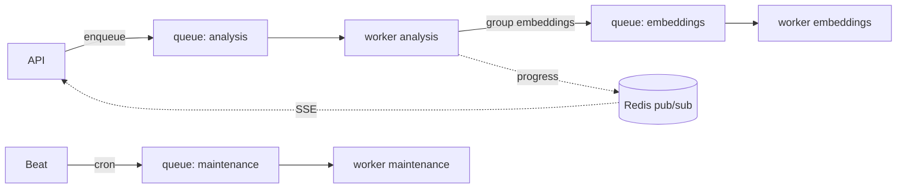

# GitInsight AI — Documento de Arquitectura Técnica y Plan de Ejecución

> Versión 1.0 · Documento de diseño previo a implementación
> Rol: Arquitectura de software senior
> Estado: **Diseño** (no se escribe código de aplicación en esta fase)

---

## 0. Resumen ejecutivo

**GitInsight AI** es una plataforma web que recibe la URL de un repositorio GitHub público, lo clona, lo analiza con una combinación de **análisis estático determinista** (tree-sitter, Ruff, Bandit, detección de secretos) y **análisis semántico con IA gratuita** (LLMs locales vía Ollama y/o niveles gratuitos de APIs, embeddings locales + RAG sobre PgVector), y devuelve:

> **Restricción de proyecto: 100% gratuito y open-source.** Todo el stack usa software libre y modelos sin coste. La capa de IA es **agnóstica del proveedor** y por defecto corre **modelos locales gratuitos** (sin tarjeta de crédito, sin cuotas de pago). Ver §12 para el detalle del stack gratuito.

- Detección de tecnologías, lenguaje principal, frameworks y arquitectura.
- Explicación del proyecto (resumen, propósito, módulos, flujo).
- Calidad de código (bugs, code smells, duplicación, complejidad, refactors).
- Seguridad (secretos, credenciales, configuraciones inseguras, nivel de riesgo).
- Documentación automática (README mejorado, docs de módulos y APIs).
- Diagramas Mermaid (arquitectura y relaciones).
- Chat con el repositorio (preguntas en lenguaje natural vía RAG).

El sistema está diseñado para **trabajo asíncrono** (los análisis son pesados): la API responde rápido y delega a workers Celery; el frontend hace polling/streaming del progreso.

### Principio rector de costos/calidad
> **"Determinista primero, IA después."**
> Todo lo que un linter, parser o regex puede resolver de forma fiable y gratuita se hace sin IA. La IA se reserva para síntesis, explicación y razonamiento. Esto reduce coste de tokens, mejora precisión y permite cachear resultados deterministas.

---

## 1. Arquitectura completa del sistema

### 1.1 Vista de alto nivel



### 1.2 Componentes

| Componente | Responsabilidad | Tecnología |
|---|---|---|
| **Nginx** | TLS, reverse proxy, servir estáticos del SPA, rate limiting básico | Nginx |
| **Frontend** | SPA, formulario de análisis, dashboard de resultados, chat, render de Mermaid | React + TS + Vite + Tailwind + React Query |
| **API** | REST, validación, auth, orquestación de jobs, streaming de progreso | FastAPI + Pydantic v2 |
| **DB** | Persistencia relacional + vectores de embeddings | PostgreSQL 16 + extensión `pgvector` |
| **Redis** | Broker de Celery, backend de resultados, cache, canal pub/sub para progreso | Redis 7 |
| **Workers** | Ejecución de análisis pesado (clonado, parseo, lint, IA, embeddings) | Celery |
| **Beat** | Tareas programadas (purga de repos, expiración de cache, reintentos) | Celery Beat |
| **Flower** | Observabilidad de colas (dev/staging) | Flower |
| **Almacenamiento efímero** | Repos clonados temporalmente | Volumen Docker / tmpfs |
| **LLM Gateway** | Abstracción de proveedor de IA (chat). Por defecto local | Ollama (local, gratis) / API free tier |
| **Embeddings** | Vectorización local de chunks de código | FastEmbed / sentence-transformers (CPU, gratis) |

Todo el stack es **software libre**. La única pieza que tradicionalmente cuesta (OpenAI) se sustituye por modelos locales gratuitos o niveles gratuitos de API. Ver §12.

### 1.3 Patrón arquitectónico

- **Backend:** arquitectura por capas + orientada a servicios internos.
  - `api/` (routers, dependencias, schemas) → `services/` (lógica de negocio) → `repositories/` (acceso a datos) → `models/` (ORM).
  - Las tareas Celery viven en `workers/tasks/` y reutilizan los `services/` (no duplican lógica).
- **Analizadores como plugins:** cada analizador (tech, quality, security, docs, diagrams) implementa una interfaz común `Analyzer.run(context) -> AnalyzerResult`. El pipeline los orquesta y agrega resultados. Esto permite añadir analizadores sin tocar el orquestador.
- **RAG como subsistema aislado:** ingestion (chunking + embeddings) y retrieval (consulta) están desacoplados detrás de un `RagService`.

### 1.4 Flujo de datos resumido

1. Usuario envía URL → API valida y crea registro `Repository` + `AnalysisJob` (estado `PENDING`).
2. API encola tarea Celery y devuelve `job_id` (HTTP 202).
3. Worker ejecuta el pipeline por fases, publicando progreso en Redis pub/sub.
4. Frontend recibe progreso (SSE o polling de React Query).
5. Worker persiste resultados estructurados en PostgreSQL + embeddings en PgVector.
6. Frontend consulta resultados finales y habilita el chat (que usa RAG sobre los embeddings ya generados).

---

## 2. Estructura de carpetas

### 2.1 Monorepo (raíz)

```
gitinsight-ai/
├── docs/
│   ├── ARQUITECTURA.md            # este documento
│   ├── API.md                     # contrato REST (generado/derivado de OpenAPI)
│   └── adr/                       # Architecture Decision Records
├── frontend/
├── backend/
├── infra/
│   ├── nginx/
│   │   └── nginx.conf
│   ├── docker/
│   │   ├── backend.Dockerfile
│   │   ├── frontend.Dockerfile
│   │   └── worker.Dockerfile
│   └── postgres/
│       └── init/                  # extensión pgvector, roles
├── docker-compose.yml
├── docker-compose.override.yml    # dev
├── .env.example
├── Makefile                       # atajos: up, down, test, lint, migrate
└── README.md
```

### 2.2 Backend (`backend/`)

```
backend/
├── app/
│   ├── main.py                    # arranque FastAPI, montaje de routers, middlewares
│   ├── core/
│   │   ├── config.py              # Settings (pydantic-settings)
│   │   ├── security.py            # auth, hashing, API keys
│   │   ├── logging.py             # logging estructurado (JSON)
│   │   └── exceptions.py          # excepciones de dominio + handlers
│   ├── api/
│   │   ├── deps.py                # dependencias (db session, current_user)
│   │   └── v1/
│   │       ├── router.py          # agrega todos los routers v1
│   │       └── routes/
│   │           ├── repositories.py
│   │           ├── analyses.py
│   │           ├── results.py
│   │           ├── chat.py
│   │           └── health.py
│   ├── schemas/                   # Pydantic (request/response DTOs)
│   │   ├── repository.py
│   │   ├── analysis.py
│   │   ├── result.py
│   │   └── chat.py
│   ├── models/                    # SQLAlchemy ORM
│   │   ├── base.py
│   │   ├── repository.py
│   │   ├── analysis.py
│   │   ├── finding.py
│   │   ├── document_chunk.py
│   │   └── chat.py
│   ├── repositories/              # data-access layer (no confundir con repos git)
│   │   ├── base.py
│   │   ├── analysis_repo.py
│   │   └── chunk_repo.py
│   ├── services/
│   │   ├── repo_service.py        # validación URL, registro
│   │   ├── analysis_service.py    # orquestación del pipeline (lado API)
│   │   ├── rag_service.py         # ingestion + retrieval
│   │   ├── llm/                    # capa de IA agnóstica del proveedor
│   │   │   ├── base.py            # interfaz LLMProvider (chat) + EmbeddingProvider
│   │   │   ├── ollama_provider.py # LLM local gratuito (por defecto)
│   │   │   ├── openai_compat.py   # cliente OpenAI-compatible (Groq/Gemini/etc. free tier)
│   │   │   ├── embeddings.py      # FastEmbed/sentence-transformers (local, gratis)
│   │   │   └── factory.py         # selecciona proveedor según config/env
│   │   └── progress_service.py    # pub/sub Redis
│   ├── analyzers/                 # subsistema de análisis (plugins)
│   │   ├── base.py                # interfaz Analyzer + AnalyzerResult + AnalysisContext
│   │   ├── pipeline.py            # orquestador de fases
│   │   ├── tech_detect.py         # lenguajes, frameworks, deps
│   │   ├── structure.py           # árbol de carpetas, arquitectura
│   │   ├── quality_ruff.py        # Ruff
│   │   ├── complexity.py          # complejidad ciclomática (tree-sitter/radon)
│   │   ├── duplication.py         # detección de duplicados
│   │   ├── security_bandit.py     # Bandit
│   │   ├── secret_scan.py         # detección de secretos (regex + entropía)
│   │   ├── explain.py             # síntesis IA: resumen, propósito, flujo
│   │   ├── docs_gen.py            # README/docs/API docs
│   │   └── diagrams.py            # generación Mermaid
│   ├── workers/
│   │   ├── celery_app.py          # instancia Celery + config
│   │   ├── tasks/
│   │   │   ├── analyze.py         # tarea raíz: orquesta el pipeline
│   │   │   ├── ingest_rag.py      # chunking + embeddings
│   │   │   └── maintenance.py     # purga repos, expiración
│   │   └── beat_schedule.py
│   └── db/
│       ├── session.py             # engine + SessionLocal (async)
│       └── migrations/            # Alembic
├── tests/
│   ├── unit/
│   ├── integration/
│   └── fixtures/                  # repos de muestra pequeños
├── alembic.ini
├── pyproject.toml                 # deps + config Ruff
└── README.md
```

### 2.3 Frontend (`frontend/`)

```
frontend/
├── index.html
├── vite.config.ts
├── tailwind.config.ts
├── tsconfig.json
├── package.json
└── src/
    ├── main.tsx
    ├── App.tsx
    ├── routes/                    # React Router
    │   ├── Home.tsx               # input de URL
    │   ├── Analysis.tsx           # dashboard con tabs
    │   └── NotFound.tsx
    ├── features/
    │   ├── analysis/
    │   │   ├── components/        # OverviewTab, QualityTab, SecurityTab, DocsTab, DiagramsTab
    │   │   ├── hooks/             # useStartAnalysis, useAnalysisProgress
    │   │   └── api.ts             # llamadas REST
    │   ├── chat/
    │   │   ├── ChatPanel.tsx
    │   │   ├── useChat.ts
    │   │   └── api.ts
    │   └── diagrams/
    │       └── MermaidRenderer.tsx
    ├── components/                # UI compartida (Button, Card, Tabs, ProgressBar)
    ├── lib/
    │   ├── apiClient.ts           # fetch/axios + interceptores
    │   ├── queryClient.ts         # React Query config
    │   └── sse.ts                 # cliente Server-Sent Events
    ├── types/                     # tipos generados desde OpenAPI
    └── styles/
        └── index.css
```

---

## 3. Modelo de base de datos

### 3.1 Diagrama entidad-relación



### 3.2 Notas de diseño del esquema

- **`repository`** se separa de **`analysis_job`** para permitir re-análisis del mismo repo (historial) y cachear por `commit_sha`. Si el `commit_sha` no cambió, se puede reutilizar el resultado anterior.
- **`finding`** unifica todos los hallazgos (quality, security, bug, smell, duplication, complexity) bajo un esquema común con `category` y `severity`. Esto simplifica filtros y la UI.
  - `category` ∈ {`bug`, `code_smell`, `duplication`, `complexity`, `secret`, `vuln`, `insecure_config`}.
  - `severity` ∈ {`info`, `low`, `medium`, `high`, `critical`}.
- **`analysis_result`** guarda los agregados/síntesis (1:1 con el job) usando `jsonb` para estructuras flexibles (frameworks, módulos, diagramas, docs) y evita explosión de tablas en el MVP.
- **`document_chunk.embedding`** es `vector(N)` (N = dimensión del modelo de embeddings, p. ej. 1536 o 3072). Índice **HNSW** o **IVFFlat** de pgvector para búsqueda por similitud coseno.
- **Índices clave:**
  - `analysis_job(repository_id, created_at)`, `analysis_job(status)`.
  - `finding(job_id, category, severity)`.
  - `document_chunk` índice vectorial sobre `embedding` + índice por `job_id`.
  - `repository(url)` único (normalizado).
- **Particionado/retención (V2):** los `document_chunk` crecen rápido; plan de purga por antigüedad vía Celery Beat.

---

## 4. Flujo de análisis de repositorios

### 4.1 Pipeline por fases



### 4.2 Detalle de fases

| Fase | Entrada | Técnica | IA | Salida |
|---|---|---|---|---|
| 1. Clonado | URL | `git clone --depth=1`, límites de tamaño | No | repo en FS efímero |
| 2. Tech detect | árbol de archivos + manifiestos (`package.json`, `pyproject.toml`, `go.mod`...) | parsing de manifiestos + extensiones + tree-sitter | No | lenguajes, frameworks, deps |
| 3. Estructura | árbol | heurísticas de arquitectura (capas, MVC, monorepo) | Opcional | árbol + arquitectura inferida |
| 4. Calidad | código | Ruff (Python), complejidad ciclomática, hashing de bloques para duplicación | No (síntesis sí) | findings de calidad |
| 5. Seguridad | código + configs | Bandit + reglas de secretos (regex + entropía) + checks de config | No | findings de seguridad + risk_level |
| 6. RAG ingest | archivos relevantes | chunking por símbolos/AST, no por líneas crudas | Embeddings | document_chunks |
| 7. Síntesis | findings + estructura + chunks top | prompt con contexto recortado | Chat | resumen, propósito, módulos, flujo |
| 8. Docs/Diagramas | síntesis + estructura | plantillas + IA | Chat | README, docs, Mermaid |

### 4.3 Reglas operativas críticas

- **Límites de seguridad del clonado** (defensa contra abuso):
  - Tamaño máximo de repo (p. ej. 500 MB), número máximo de archivos, timeout de clonado.
  - Solo HTTPS de `github.com`, validación estricta de URL (anti-SSRF).
  - Clonado en sandbox (usuario sin privilegios, sin ejecución de hooks: `git -c core.hooksPath=/dev/null`).
  - **Nunca ejecutar** código del repo. Solo lectura estática.
- **Selección de archivos para IA:** se ignora `node_modules`, `dist`, binarios, lockfiles; se prioriza por relevancia (entrypoints, configs, código fuente) para no malgastar tokens.
- **Idempotencia:** si llega el mismo `commit_sha` ya analizado y reciente → se reutiliza resultado (cache hit) en lugar de re-analizar.
- **Limpieza:** el FS del repo se borra al terminar (éxito o fallo). Beat purga huérfanos.

---

## 5. Sistema de colas para tareas pesadas

### 5.1 Diseño de colas

- **Broker/result backend:** Redis.
- **Colas separadas por perfil de carga** (evita que un repo gigante bloquee tareas cortas):
  - `analysis` — pipeline principal (CPU + I/O).
  - `embeddings` — llamadas a OpenAI embeddings (I/O-bound, alta latencia).
  - `maintenance` — purga, expiración (baja prioridad).
- **Workers dedicados** por cola con concurrencia ajustada:
  - `analysis`: pocos workers, concurrencia baja (uso intensivo de CPU/disco).
  - `embeddings`: mayor concurrencia (I/O), con rate-limit hacia OpenAI.

### 5.2 Orquestación de la tarea raíz

- `analyze(job_id)` ejecuta las fases secuencialmente dentro de un worker (las fases comparten el repo en disco, por lo que dividirlas entre workers obligaría a re-clonar). Internamente puede paralelizar subtareas CPU-bound con un pool.
- La **ingestión de embeddings** se hace en lotes (batching) y, si es grande, se delega como subtareas a la cola `embeddings` con un `chord`/`group` que reagrupa al terminar.

### 5.3 Fiabilidad

- **Reintentos** con backoff exponencial para fallos transitorios (red, rate limit de OpenAI). Errores deterministas (repo inexistente, demasiado grande) → fallo inmediato con mensaje claro.
- **Timeouts** por tarea (`soft_time_limit` + `time_limit`) para evitar workers colgados.
- **Idempotencia:** la tarea verifica el estado del job antes de empezar (evita doble ejecución).
- **Visibilidad:** progreso publicado en Redis pub/sub por fase; estado persistido en `analysis_job.phase` y `progress_pct`.
- **Dead-letter:** jobs fallidos quedan en `FAILED` con `error_message`; reintento manual desde la API.

### 5.4 Diagrama de colas



---

## 6. API REST

Base: `/api/v1`. Autenticación: en MVP, API key opcional / sesión anónima por job. Versionado por path. Errores con formato consistente `{ "error": { "code", "message", "details" } }`.

### 6.1 Endpoints

| Método | Ruta | Descripción | Respuesta |
|---|---|---|---|
| `GET` | `/health` | Liveness/readiness | `200` |
| `POST` | `/analyses` | Inicia análisis. Body: `{ "url": "..." , "options": {...} }` | `202 { job_id, status }` |
| `GET` | `/analyses/{job_id}` | Estado del job (status, phase, progress) | `200` |
| `GET` | `/analyses/{job_id}/stream` | Progreso en tiempo real (SSE) | `text/event-stream` |
| `GET` | `/analyses/{job_id}/result` | Resultado agregado (overview, summary, scores, diagrams, docs) | `200` / `409` si no listo |
| `GET` | `/analyses/{job_id}/findings` | Hallazgos. Filtros: `category`, `severity`, `file`, paginación | `200` |
| `GET` | `/analyses/{job_id}/diagrams` | Diagramas Mermaid generados | `200` |
| `GET` | `/analyses/{job_id}/docs` | Docs generadas (README, módulos, APIs) | `200` |
| `POST` | `/analyses/{job_id}/retry` | Reintenta un job fallido | `202` |
| `DELETE` | `/analyses/{job_id}` | Borra job y datos asociados | `204` |
| `GET` | `/repositories/{id}/analyses` | Historial de análisis de un repo | `200` |
| `POST` | `/analyses/{job_id}/chat/sessions` | Crea sesión de chat | `201 { session_id }` |
| `POST` | `/chat/sessions/{session_id}/messages` | Pregunta (RAG). Body: `{ "message": "..." }`. Opción streaming | `200` / SSE |
| `GET` | `/chat/sessions/{session_id}/messages` | Historial del chat | `200` |

### 6.2 Convenciones

- **Asíncrono por defecto** para cualquier operación pesada (siempre `202` + polling/SSE).
- **Paginación** por cursor o `limit/offset` en colecciones (`findings`, mensajes).
- **OpenAPI** auto-generado por FastAPI; el frontend genera tipos TS desde el esquema (`openapi-typescript`) para evitar drift.
- **Rate limiting** en Nginx + por API key (protege el worker local de IA y los free tiers).
- **CORS** restringido al dominio del frontend.

### 6.3 Contrato de ejemplo (POST /analyses)

```
Request:
  { "url": "https://github.com/owner/repo",
    "options": { "deep_quality": true, "generate_docs": true } }

Response 202:
  { "job_id": "uuid", "status": "PENDING",
    "links": { "self": "/api/v1/analyses/uuid",
               "stream": "/api/v1/analyses/uuid/stream" } }
```

---

## 7. Roadmap (MVP → V1 → V2)

### MVP (núcleo demostrable)
**Meta:** un repo Python/JS entra, sale un análisis útil.
- Clonado seguro + detección de lenguaje principal y frameworks (manifiestos).
- Estructura de carpetas + árbol.
- Calidad: Ruff (Python) + complejidad básica.
- Seguridad: Bandit + detección de secretos (regex).
- Síntesis IA: resumen + propósito + módulos.
- 1 diagrama Mermaid de arquitectura (alto nivel).
- Cola Celery (1 cola), progreso por polling.
- Frontend: input de URL + dashboard con tabs (Overview, Quality, Security).
- Docker Compose levantando todo localmente.

### V1 (producto completo)
- Multi-lenguaje real vía tree-sitter (JS/TS, Python, Go, Java mínimo).
- Detección de duplicación + detección de bugs/code smells con IA.
- Documentación automática completa (README mejorado, docs de módulos, APIs detectadas).
- **Chat RAG** con PgVector (embeddings + retrieval + citaciones de archivos).
- Diagramas de relaciones entre componentes.
- SSE para progreso en tiempo real.
- Colas separadas (analysis/embeddings/maintenance), reintentos, timeouts.
- Cache por `commit_sha`, historial de análisis.
- Auth ligera (API keys), rate limiting.

### V2 (escala y diferenciación)
- Soporte de repos privados (OAuth GitHub, tokens cifrados).
- Análisis incremental (diff entre commits, PRs).
- Webhooks de GitHub (análisis automático en push/PR).
- Métricas de evolución (tendencias de calidad/seguridad en el tiempo).
- Exportación (PDF/Markdown), comparación entre repos.
- Multi-tenant, planes/cuotas, billing.
- Observabilidad completa (OpenTelemetry, dashboards), escalado horizontal de workers.
- Posible reducción de coste con modelos locales para tareas baratas.

---

## 8. Riesgos técnicos

| # | Riesgo | Impacto | Probabilidad | Mitigación |
|---|---|---|---|---|
| R1 | **Coste de IA** (eliminado por diseño: stack gratuito) | Bajo | Baja | LLM local (Ollama) y embeddings locales sin coste; si se usa free tier, respetar límites; determinista primero, recorte de contexto, cache por commit |
| R1b | **Hardware local insuficiente** para LLM (RAM/GPU) | Alto | Media | Modelos pequeños/cuantizados (3B–8B Q4); CPU fallback; opción de free tier remoto (Groq/Gemini) vía mismo gateway; degradar a "solo determinista" si no hay recursos |
| R2 | **Seguridad del clonado** (SSRF, repos maliciosos, hooks, zip-bombs) | Crítico | Media | Validación estricta de URL, solo github.com, `--depth=1`, límites de tamaño/archivos, deshabilitar hooks, sandbox sin privilegios, **nunca ejecutar** código |
| R3 | **Tareas largas** saturan workers / timeouts | Alto | Media | Colas separadas, time limits, límites de tamaño, paralelización acotada |
| R4 | **Calidad del análisis IA** (alucinaciones, citas falsas) | Alto | Media | RAG con citaciones verificables, grounding en findings deterministas, temperatura baja, validación de salidas estructuradas |
| R5 | **Dimensión/índice de embeddings** mal elegidos → retrieval pobre | Medio | Media | Chunking por AST/símbolos, índice HNSW, evaluación de retrieval con repos de prueba |
| R6 | **Multi-lenguaje** con tree-sitter es trabajo grande | Medio | Alta | Empezar con 2 lenguajes; arquitectura de analizadores como plugins |
| R7 | **Crecimiento de almacenamiento** (chunks/vectores) | Medio | Media | Retención/purga vía Beat; particionado en V2 |
| R8 | **Rate limits del free tier / saturación del LLM local** | Medio | Media | Backoff, cola dedicada con throttling, concurrencia limitada en Ollama, reintentos idempotentes |
| R8b | **Calidad inferior de modelos gratuitos** vs. modelos de pago | Medio | Media | Grounding fuerte en findings deterministas; prompts simples y acotados; salidas estructuradas validadas; el gateway permite cambiar de modelo sin tocar código |
| R9 | **Deriva de contrato** frontend/backend | Bajo | Alta | Tipos TS generados desde OpenAPI en CI |
| R10 | **Falsos positivos** de secretos/seguridad | Medio | Alta | Combinar regex + entropía + allowlist; marcar confianza; permitir descartar |
| R11 | **Sobre-alcance** (10 features a la vez) para 1 persona | Alto | Alta | Roadmap estricto MVP→V1→V2; no construir V1/V2 antes del MVP |

---

## 9. Plan de desarrollo para una sola persona

Diseñado para un único desarrollador full-stack, en incrementos verticales (cada hito produce algo demostrable end-to-end). Estimaciones en "tramos de trabajo" (no fechas, ajústalas a tu disponibilidad).

### Fase 0 — Cimientos (scaffolding)
1. Repo monorepo + estructura de carpetas (§2).
2. Docker Compose: Postgres+pgvector, Redis, backend, worker, frontend, nginx.
3. Backend mínimo: FastAPI `main.py`, `config`, `/health`, conexión DB, Alembic inicial.
4. Frontend mínimo: Vite + Tailwind + React Query + página Home con input.
5. Celery conectado a Redis + tarea "ping" de prueba.
6. `Makefile`, `.env.example`, README. **Hito: `docker compose up` levanta todo y responde `/health`.**

### Fase 1 — Pipeline determinista (sin IA)
7. Servicio de clonado seguro (límites, validación URL).
8. Modelos + migraciones: `repository`, `analysis_job`, `finding`, `analysis_result`.
9. `POST /analyses` → encola; worker clona y detecta lenguaje/frameworks/estructura.
10. Analizadores: tech_detect, structure, Ruff, complejidad, Bandit, secret_scan.
11. Persistir findings + result; `GET /result` y `GET /findings`.
12. Frontend: dashboard con tabs Overview/Quality/Security + polling de progreso.
**Hito: análisis real de un repo Python visible en la UI, sin IA.**

### Fase 2 — Capa IA (síntesis)
13. `llm_service` (wrapper OpenAI + retries + recorte de contexto).
14. Analizador `explain`: resumen, propósito, módulos, flujo (grounded en findings/estructura).
15. `diagrams`: generación Mermaid + `MermaidRenderer` en frontend.
16. `docs_gen`: README mejorado + docs de módulos.
**Hito: el dashboard muestra explicación IA + diagrama Mermaid.**

### Fase 3 — RAG + Chat
17. Ingestión: chunking por AST, embeddings, almacenamiento en PgVector (índice HNSW).
18. `rag_service`: retrieval + construcción de prompt con citaciones.
19. Endpoints de chat + `ChatPanel` en frontend (con fuentes citadas).
20. SSE para chat y progreso.
**Hito: preguntar al repo y recibir respuestas con referencias a archivos.**

### Fase 4 — Endurecimiento
21. Colas separadas, reintentos, timeouts, limpieza (Beat).
22. Cache por commit, historial, rate limiting, manejo de errores robusto.
23. Tests (unit + integration con repos fixture), CI básico.
24. Pulido de UX, estados de error/carga, documentación.
**Hito: V1 estable y desplegable.**

### Prácticas para sostenibilidad (1 persona)
- **Vertical slices**: nunca dejar el sistema sin poder demostrarse.
- **ADRs** breves para decisiones clave (modelo de embeddings, dimensión, chunking).
- **Tests donde más duele**: clonado, parseo, retrieval.
- **Feature flags** para activar/desactivar IA y RAG (controla coste durante el desarrollo).

---

## 10. Archivos iniciales del proyecto (scaffolding)

> Esta sección **especifica** qué archivos se generarán en la Fase 0. Como pediste, **no se escribe código todavía**; aquí queda el inventario y propósito de cada archivo inicial para aprobar antes de generarlos.

### 10.1 Raíz
- `docker-compose.yml` — servicios: `db` (postgres+pgvector), `redis`, `backend`, `worker`, `beat`, `frontend`, `nginx`, `flower` (dev) y **`ollama`** (LLM local gratuito; perfil opcional para poder desactivarlo si se usa free tier remoto).
- `docker-compose.override.yml` — montajes de volúmenes y hot-reload en dev.
- `.env.example` — `DATABASE_URL`, `REDIS_URL`, `LLM_PROVIDER` (`ollama`|`openai_compat`), `LLM_BASE_URL` (p. ej. `http://ollama:11434`), `LLM_MODEL` (p. ej. `qwen2.5-coder:7b`), `LLM_API_KEY` (vacío para local; clave del free tier si aplica), `EMBEDDING_MODEL` (p. ej. `BAAI/bge-small-en-v1.5`), `EMBEDDING_DIM`, límites de clonado, `CORS_ORIGINS`. **Sin claves de pago obligatorias.**
- `Makefile` — `up`, `down`, `logs`, `migrate`, `revision`, `test`, `lint`, `fmt`.
- `README.md` — visión, requisitos, cómo levantar, arquitectura (enlace a este doc).

### 10.2 Backend
- `backend/pyproject.toml` — dependencias (fastapi, uvicorn, sqlalchemy, asyncpg, alembic, pydantic-settings, celery, redis, gitpython, tree-sitter, ruff, bandit, **fastembed** o **sentence-transformers** para embeddings locales, **httpx** para hablar con Ollama/free-tier vía API OpenAI-compatible, pgvector) + configuración de Ruff. Todas las librerías son open-source y gratuitas.
- `backend/alembic.ini` + `backend/app/db/migrations/` — migraciones (inicial: tablas + extensión pgvector).
- `backend/app/main.py` — instancia FastAPI, middlewares, routers, manejadores de error.
- `backend/app/core/config.py` — `Settings` con pydantic-settings.
- `backend/app/api/v1/router.py` + `routes/health.py` — health check inicial.
- `backend/app/workers/celery_app.py` — instancia Celery + tarea "ping".
- `backend/app/db/session.py` — engine async + sesión.
- `backend/app/models/base.py` — Base declarativa + mixins (id uuid, timestamps).

### 10.3 Frontend
- `frontend/package.json` — react, react-dom, react-router, @tanstack/react-query, axios, tailwind, vite, typescript, mermaid, openapi-typescript.
- `frontend/vite.config.ts`, `tailwind.config.ts`, `tsconfig.json`.
- `frontend/index.html`, `src/main.tsx`, `src/App.tsx`, `src/lib/{apiClient,queryClient}.ts`.
- `frontend/src/routes/Home.tsx` — input de URL (placeholder funcional).
- `frontend/src/styles/index.css` — Tailwind base.

### 10.4 Infra
- `infra/nginx/nginx.conf` — proxy `/` → frontend, `/api` → backend, headers SSE.
- `infra/docker/{backend,worker,frontend}.Dockerfile`.
- `infra/postgres/init/01-extensions.sql` — `CREATE EXTENSION IF NOT EXISTS vector;`.

---

## 11. Decisiones de arquitectura abiertas (a confirmar)

Estas decisiones afectan implementación y conviene fijarlas antes de generar el scaffolding:

1. **Modelo y dimensión de embeddings** (define el tipo `vector(N)` de la tabla). Recomendación gratuita: `BAAI/bge-small-en-v1.5` (384 dims, corre en CPU vía FastEmbed). Dejar la dimensión configurable.
2. **Proveedor y modelo de chat IA**: **FIJADO para 16 GB RAM + iGPU Vega 8 (CPU-only)** → recomendado **híbrido**: **Groq free tier** para chat/síntesis (rápido, $0) + **Ollama `qwen2.5-coder:3b`** como respaldo offline + **embeddings locales** `bge-small`. Alternativa 100% local/offline: Ollama 3b (o 7b si aceptas lentitud). Ver §12.5.
3. **Autenticación en MVP**: ¿anónima por job (más simple) o API key desde el inicio?
4. **Async vs sync en SQLAlchemy**: el diseño asume **async** (asyncpg). Confirmar.
5. **Lenguajes objetivo del MVP**: recomendación Python + JS/TS primero.

---

## 12. Stack 100% gratuito y open-source (capa de IA)

> Esta sección documenta cómo se cumple la restricción de **materiales gratuitos**. El resto del stack (FastAPI, PostgreSQL, pgvector, Redis, Celery, React, Vite, Tailwind, GitPython, tree-sitter, Ruff, Bandit, Docker, Nginx) **ya es libre y gratuito** por definición.

### 12.1 Estrategia: gateway de IA agnóstico del proveedor

La aplicación nunca llama a un SDK propietario directamente. Habla con una interfaz interna (`LLMProvider` / `EmbeddingProvider`, ver §2.2 `services/llm/`). Esto permite **cambiar de modelo o proveedor por configuración** (`.env`), sin tocar código, y garantiza que siempre exista una opción 100% gratis.

| Necesidad | Opción por defecto (gratis, local) | Alternativa gratis (remota) | Coste |
|---|---|---|---|
| **Chat / síntesis IA** | **Ollama** (Llama 3.x, Qwen2.5-Coder, Mistral, Phi) | Free tier de **Groq**, **Google Gemini**, **OpenRouter** (modelos `:free`) | $0 |
| **Embeddings** | **FastEmbed** o **sentence-transformers** (`bge-small`, `all-MiniLM`) en CPU | Embeddings de free tier (Gemini/Jina free) | $0 |
| **Vector store** | **pgvector** (ya en el stack) | — | $0 |

Ollama expone una **API OpenAI-compatible**, igual que Groq, Gemini (modo compat) y OpenRouter. Por eso un único cliente `httpx` apuntando a `LLM_BASE_URL` sirve para todos: solo cambia la URL y, si aplica, la API key del free tier.

### 12.2 Recomendación de modelos gratuitos

- **Código/chat (local):** `qwen2.5-coder:7b` (excelente para código) o `llama3.1:8b`. Versiones cuantizadas (Q4) para reducir RAM.
- **Equipo modesto (poca RAM/sin GPU):** modelos 3B (`qwen2.5-coder:3b`, `phi3.5`) o usar free tier remoto.
- **Embeddings:** `BAAI/bge-small-en-v1.5` (384 dims) — rápido en CPU, calidad sólida para retrieval de código.

### 12.3 Requisitos de hardware (orientativo, modelos locales)

| Modelo | RAM aprox. | GPU | Velocidad |
|---|---|---|---|
| 3B Q4 | ~4 GB | opcional | aceptable en CPU |
| 7–8B Q4 | ~8 GB | recomendable | buena con GPU, lenta en CPU |
| Embeddings bge-small | <1 GB | no | rápido en CPU |

Si el hardware no alcanza, el mismo gateway permite usar un **free tier remoto** (Groq es muy rápido y gratuito con registro), manteniendo coste $0. Como último recurso, la app puede degradar a **modo solo-determinista** (sin IA) mediante feature flag y seguir siendo útil (tech detect, calidad, seguridad, estructura).

### 12.5 Configuración recomendada para tu equipo (16 GB de RAM)

Presupuesto de RAM aproximado con todo el stack levantado en Docker:

| Componente | RAM aprox. |
|---|---|
| Postgres + Redis + backend + worker + frontend dev | ~3–4 GB |
| Embeddings `bge-small` (CPU) | <1 GB |
| **Ollama `qwen2.5-coder:7b` Q4** | ~5–6 GB |
| **Total** | **~9–11 GB** (entra en 16 GB con margen) |

**Nota sobre GPU integrada (AMD Vega 8 / iGPU):** las iGPU Vega comparten la RAM del sistema y **no están soportadas oficialmente por ROCm** (gfx90c/gfx902). La aceleración por GPU no es fiable; se planifica como **inferencia solo-CPU**.

Recomendaciones prácticas (equipo CPU-only, iGPU Vega 8, 16 GB):
- **Por defecto recomendado:** `LLM_MODEL=qwen2.5-coder:3b`. En CPU ofrece el mejor equilibrio velocidad/calidad y deja RAM de sobra.
- **Opcional:** `qwen2.5-coder:7b` también entra en 16 GB, pero en CPU será **lento** (decenas de segundos por respuesta). El análisis es asíncrono (Celery), así que no bloquea la UI; útil si priorizas calidad sobre velocidad.
- **Para chat fluido sin coste:** usar **Groq free tier** para chat/síntesis (respuestas casi instantáneas, $0) y mantener **embeddings locales**. Es la opción más cómoda con este hardware. Solo cambia `LLM_PROVIDER`/`LLM_BASE_URL`/`LLM_API_KEY` en `.env`.
- **Híbrido recomendado:** Groq para chat + Ollama 3b como respaldo offline + embeddings locales `bge-small`. Todo $0.
- **Concurrencia de Ollama a 1** en el worker para no exceder RAM con peticiones paralelas.

### 12.4 Garantías de gratuidad

- **Sin claves de pago obligatorias:** `LLM_API_KEY` puede ir vacío (modo local).
- **Funciona offline** en modo Ollama (tras descargar el modelo una vez).
- **Sin dependencias propietarias** en `pyproject.toml` ni en `package.json`.
- **Licencias permisivas** (MIT/Apache/BSD) en todo el stack; modelos con licencias de uso gratuito.

---

*Fin del documento de arquitectura. Próximo paso sugerido: aprobar §10, §11 y §12 para proceder con la generación del scaffolding (Fase 0).*
